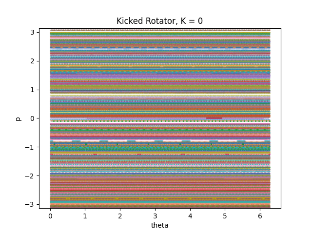
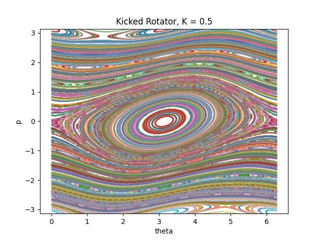
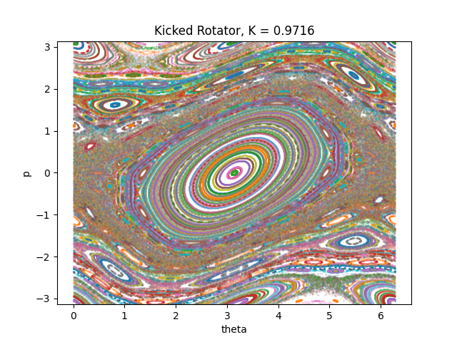
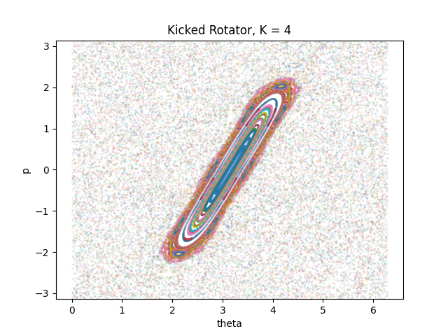

# Kicked rotator
## Introduction
Imagine having a stick that is free to rotate around one of its ends in the absence of gravity. Now imagine giving to the free end a kick every $T$ seconds. Let $K$ be the strenght of the kick.

The dynamics of this system is described by the **Chirikov standard map**.
$$ p_{n+1} = p_n + K sin(\theta) \quad\theta_{n+1} = \theta_n + p_{n+1}$$

## Chaos
For K sufficiently large each kick is so strong the position of 2 consecutive kicks can be considered statistically uncorrelated.
This lead to a chaotic dynamic.

## Diffusive behaviour

## References
- https://journals.aps.org/pre/pdf/10.1103/PhysRevE.67.046220
- https://boulderschool.yale.edu/sites/default/files/files/Delande-kicked_rotor_lectures_1_and_2.pdf